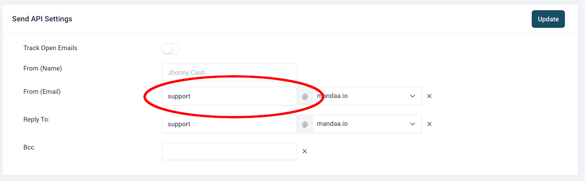

## Getting started

### Sending your first email

#### First API call - an overview


In order to send your first email using EUmail API you need to setup the following requirements first.

- Create a EUmail account
- Define your domain and set you default FROM email address
- Create an API key
- Create a template (optional)
- Send your first email using the API


#### Step 1

**Create a EUmail account**

Go to [https://app.mandaa.io/signup](https://app.mandaa.io/signup) and complete the signup flow including receiving your activation email and clicking the link to activate your new account.

#### Step 2

**Define your domain** Make sure you are logged into you EUmail account. Go to [EUmail domains page](https://app.mandaa.io/domains) Click on the button in the upper right corner to add a  A dialog box will open like this:

 Fill in your domain name. 
It must be a domain that you own and that exists already on the internet. Now click the button “Add domain” and your domain will have been created (defined) within EUmail. Now go to and set the first part of the FROM email name and then select your domain from the drop down list.



The FROM email is the email address (within your domain) that emails are sendt from. Examples of popular names are “customerservice”, “support”, “sales” etc. When you have entered your from name and selected the domain, then click the “Update” button.

#### STEP 3
**Create an API token**

Go to the menu and select the API keys menu or click here [API keys](https://app.mandaa.io/integrations/api_tokens) Click the “Create API Key” button and enter the API key name – for example “API demo key”. Then click the “Create & View” button.

You will now be shown a message saying that the key has been generated. Copy the key using the copy button and keep it safe as it is needed later. You will not be able to see it again ever in EUmail, but you can always make a new one if you loose the key.


#### STEP 4

**Create template (optional)** Log into EUmail and go to the [templates section](https://app.mandaa.io/templates) . Create a new template. Save the template version and make it active and then go back to the template list. Copy the template id using the copy icon as you will need this in the next step.

You can read more about creating EUmail templates in [EUmail templates](https://app.mandaa.io/documentation/templates/eumail_templates/).

#### STEP 5

**Make Request to Send Email**

Making the call to send emails will usually come from your own system or some code that you write og maybe a system like [Zapier](https://zapier.com/) . But for the sake of just testing you API key you can use the command line method below.

Using Curl ( [https://en.wikipedia.org/wiki/CURL](https://en.wikipedia.org/wiki/CURL) ) on the command line, you can make a single command to send a mail using EUmail. Remember to replace the template id and the API token with the real values from step 1 and 2.

When you have confirmed that you can send an email using your API key and template then you can start to implement this into your application. Remember to replace the placeholders “[]” below with your own parameters from the previous steps and change the FROM email.

```curl
curl --request POST --url https://send.mandaa.io/mail/v1/send

--header 'Authorization: Bearer [insert your API kode here]'

--header 'Content-Type: application/json'

--data '{

  "recipients":

    {

      "to":[{"email":"test@example.com"}]

    },

    "parameters": {

      "template":"[Insert template id here]",

      "subject":"Your own subject here"

    },

    "mergedata":{"name":"Jane Doe", "city":"Downtown"},

    "send_mode": "normal",

    "from": "from@example.com",

    "reply_to": "reply-to@example.com"

  }'

```

## Problems or questions?
If you have any problems or questions then please don’t hessitate to contact our support at [support@mandaa.io](mailto:support@mandaa.io) . Support on getting started is FREE!