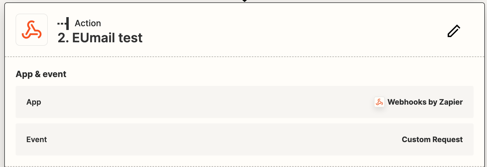
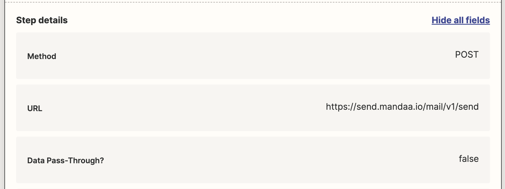
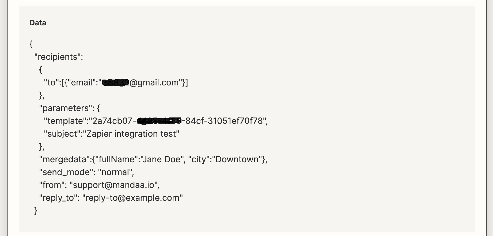
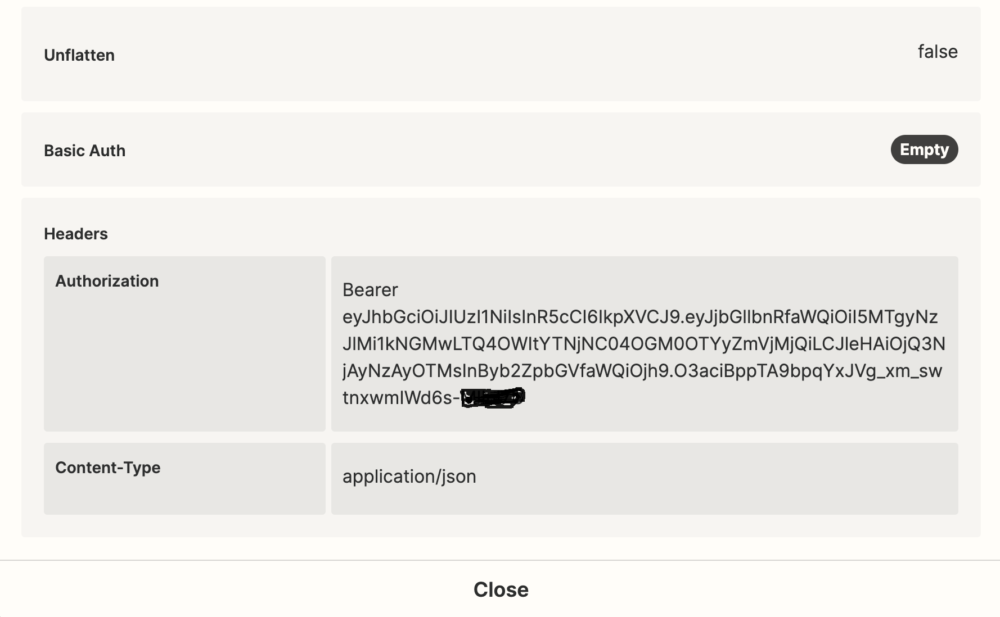

## Integrations


This guide will help you seamlessly connect these two powerful platforms, enabling you to automate your email workflows effortlessly. By integrating Zapier with EUmail, you can leverage the extensive automation capabilities of Zapier to trigger email actions and utilize the robust email delivery infrastructure of EUmail. Whether you want to send personalized email notifications, automate email, or streamline your communication processes, this documentation will walk you through the steps to set up and configure the integration.

## How to set up a Zapier Zap

Before doing the integration to EUmail you must set up the action that should trigger a call to EUmail. You must do this like you normally do with other Zapier Zaps.

For this demo we just set up a “Schedule by Zapier” trigger that runs every day at a specified time. In your implementation this will probably be something else.

For the integration to EUmail we use Zapiers own “Webhooks by Zapier”. Unfortunately this is only available for paid plans with Zapier, so we will look into building a Mandaa EUmail App and make it available in Zapier.

Before you start your integration of Zapier and EUmail you must be ready to create the follwing in EUmail

- API key for use in Zapier
- A template that you will use for your emails

### Step 1 - integration type

Select “Webhooks by Zapier” and select “custom request” as the event type.



### Step 2 - call type

Define request method as “POST”, insert the URL to the EUmail API and set “Data pass through” to false.



### Step 3 - content

Copy the following JSON into the “Data” field and modify with your own values. Some fields are mandatory and others are optional. You will need to use Zapiers merge fields for some of the data in the Zap in your real use.

```json
{

  "recipients":

    {

      "to":[{"email":"test@example.com"}]

    },

  "parameters": {

      "template":"[Insert template id here]",

      "subject":"Your own subject here"

    },

  "mergedata":{

    "name":"Jane Doe", 

    "city":"Downtown"

    },

  "send_mode": "normal",

  "from": "from@example.com",

  "reply_to": "reply-to@example.com"

}
```



### Step 4 - auth

Finally you need to setup the authentication for the call to Mandaa EUmail. You will need an API token that you can create within the EUmail user interface (as an Admin user).

Then you create the following two **header values**:
- Authentication
- Content-Type

In the value part of the Authentication you must first write the word “Bearer”, then a space and then insert the API key.



### Conclusion

You should now be able to test your new integration between Zapier and Mandaa EUmail with succes.

If you have any problems with this integration, then please write our support at [support@mandaa.io](mailto:support@mandaa.io) and let us help you setup the integration.