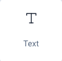
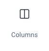
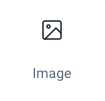
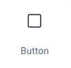
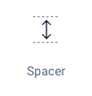
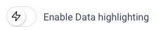
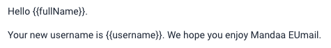
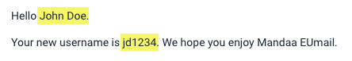

### Modules

EUmail supports five different module types with more to come.

##### Text



Text modules is where you write both your static content and the placeholders for your dynamic content. The text modules support various formatting like size, color, adjustment etc. You can have several paragraphs of text within one text module or one module per paragraph. We recommend not to make each text module too large.

##### Columns



Applying a column module divides the content section up into two identical columns each 50% of the width. It is currently not possible to change this ratio or have more than two columns.

In each of the two columns you can insert other modules but not another column module.

##### Images



Images can be inserted and will be encoded and embedded within the email. After inserting an image you can resize the image and adjust the alignment.


Although it is possible to resize images in Eumail we recommend to avoid inserting large images and the resizing. It is better to make the resize offline and the insert the image and display it at 100% size. This gives you more control over the result and avoid sending large images in emails which is a bad practice given that manu emails are read on mobile phones with limited bandwith.


##### Buttons



Buttons are inserted as their own paragraph in the email and can be aligned left, center and right. You can control the foreground and background color of the button as well as the background color of the module you have inserted.

As static text of your choosing can be written on the button and the button auto-adjusts its size according to text width. We recomment to keep texts relatively short to allow for pretty presentation on mobile devices.

It is possible to define a link for the button and the link is opened when the button is clicked in the email. Links can be dynamic like “[https://mandaa.io/order/?{{ordernumber}}](https://mandaa.io/order/?%7b%7bordernumber%7d%7d%22)" where the ordernumber must be defined in the merge data (see below) or static like “[https://mandaa.io](https://mandaa.io/) ”.

##### Spacer



The Spacer module can be used to force som vertical space between two other modules or to create a horizontal line by setting the color of the spacer.

#### Appearance tab - Background color

The default content background color is white. The reason for this is that if left undefined then some email clients will display the backhground as black and this usually mean that most of the text cannot be seen.

You can change the background color of the content section of the email in the “Appearance” tab.

#### Subject field

In the subject field you can define a default subject line for emails sent out based on the current template. If the subject is defined in the API call, then the subject from the API call has preference and the one from the editor will not be used.

Subject fields can be static or include fields for merging data.

#### Merge fields


Merge fields are the cornerstone of EUmails ability to delivery dynamic content. This is done using EUmail [dynamic templates](/documentation/templates/dynamic_templates/) .

Within the editor you can use the “Data (JSON)” text field to define your sample merge fields. We recomment that you make sample data for ALL data field that you expect to use in your template.

The data you define in this area are only ever used when sending test mails from within the EUmail editor. When sending emails using the API you must provide the full set of merge fields in the API call.

Merge fields are inserted into the document using handlebars that is a set of double curly brackets `{{}}` with the field name inside like in this example `{{ordernumber}}`.

The merge fields must be defines in the[ JSON format](https://en.wikipedia.org/wiki/JSON) . The format is not tolerant towards syntax errors, so be carefull to write it correctly.

```json
{

	"orderNumber":"OC1234",

	"customerNumber":"C-7657",

	"recipientEmail":"jd@nowhere.net"

}
```

We will show an error “JSON invalid” below the data field if there is a problem with your JSON syntax. Please note that you should no have a comma after the last key-value pair.

#### Preview mode


Preview mode will switch the right side of the editor into a preview mode where it will display the email as it will look when sending the email. It will no longer show the merge fields but rather the data from the demo data set in the left side. If no demo data is defined then merge fields will be shown as blanks.

#### Data highlighting



When in preview mode you can enable to highlight merge fields. This is especially usefull when you open a previous template for editing and you are in doubt what parts of the email that are filled with merge data.

All merge fields will be shown as highlighted with a yellow background color

Highlight off 

Highlight on 

#### Test mails

When you created your sample data and your email content it is time to test the email. The pre-requisit to sending test emails from EUmail is that you must have defined your domainname and FROM email - see [Configuration](/documentation/getting-started/configuration/) .

## Problems or questions?
If you have any problems or questions then please don’t hessitate to contact our support at [support@mandaa.io](support@mandaa.io). Support on getting started is FREE!