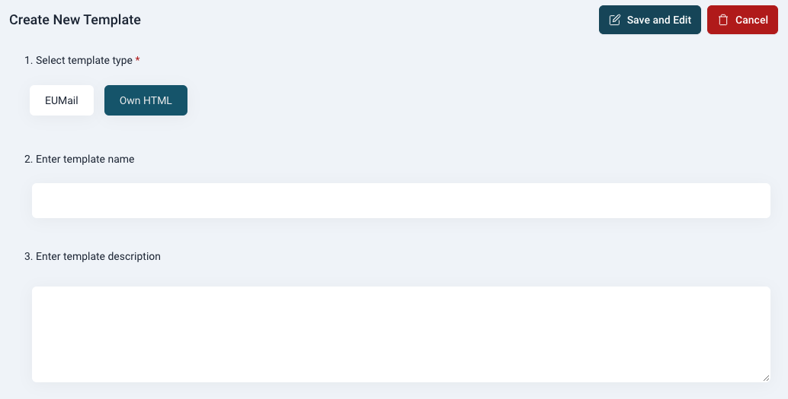
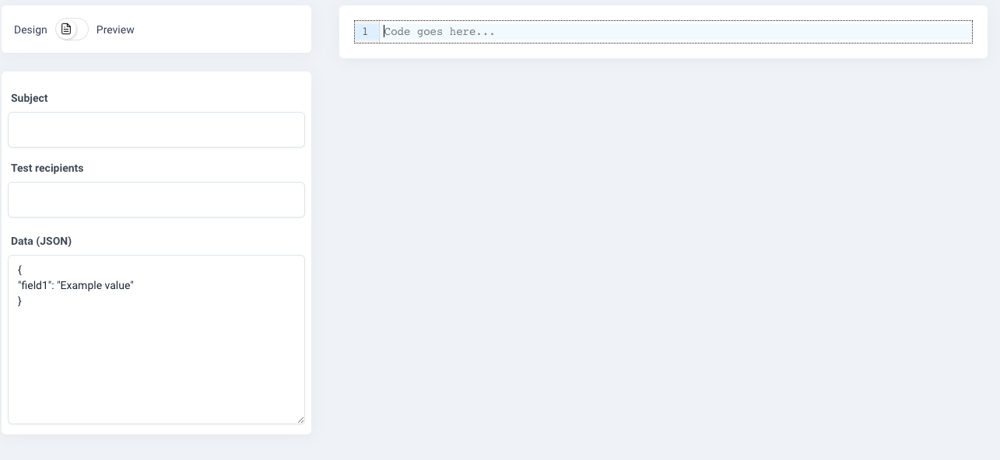
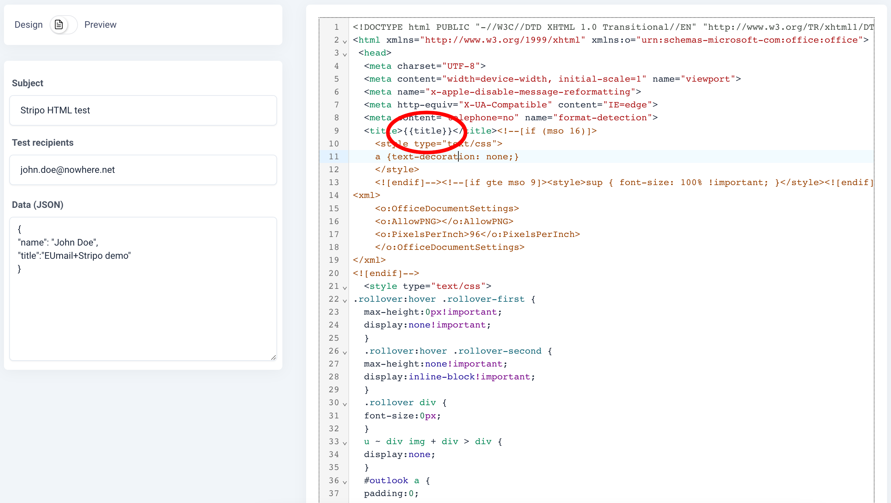

Mandaa EUmails integrated template editor is a good tool for creating and maintaining email templates and it is in some areas superior to other integrated editors out there.

But sometimes you just need the transport infrastructure with your own HTML templates.

We already support that you send your own HTML when you call our API, but this is now an option in our built in editor also.

You can now also create a template configured for your HTMl and use our HTML editor to write your template or copy/paste the HTML in from another source like for example:

- [Alpaco](https://alpaco.email/)
- [Stripo](https://stripo.email/)
- [BEE](https://beefree.io/bee-pro/)
- [Unlayer](https://unlayer.com/)
- [Stensul](https://stensul.com/)

You can also use the template logic in your HTML templates as it is described under [Dynamic templates](/documentation/templates/dynamic_templates/) .

### How to create a HTML template

Below we have an example of a HTML template with content from a Stripo demo template. If the template does not already have handlebars with mergedata, then you can add these after you have imported the template in the editor.

#### Step 1

Go to the Template section of EUmail and select New temeplate and then select the “Own HTML” template type



Add your template name and an optional descripion and hit “Save and edit”.

#### Step 2

Fill in your email suject and you are ready to fill in your HTML template. You can now either write your own email HTML (complete with header), copy/paste you HTML into the editor or drag&drop a HTML file into the editor.



#### Step 3

Now you have a HTML template and it’s time to finish your email template. You should now write your email subject and create to sample merge data. Remember, that you can use merge data in the subject too.

If for example you send out orderconfirmation that have an order number. You can then include the ordernumber in you merge data and use it in the subect, where your subject would look like:

```
“Orderconfirmation from MyWebShop - your order number is {{$ordernumber}}”
```

Remember that the data in the “Data (JSON)” field is just sample data for your while developing your email template. You must provide the same merge data fields in your webcall to EUmail when sending your orderconfirmations or other documents.

In the example below we have inserted an html page title (not used in emails) and also a name - in this case “John Doe”.



In our editor you can switch to preview, where you are able to see how your email will look - including your merge data. We have used our highlight feature here, so that you can easily see what part of the email content that are provided by merge fields.


#### Step 4

Below you will find a screenshot from an email base on a template imported from Scripo witht the name “John Doe” merged in.

